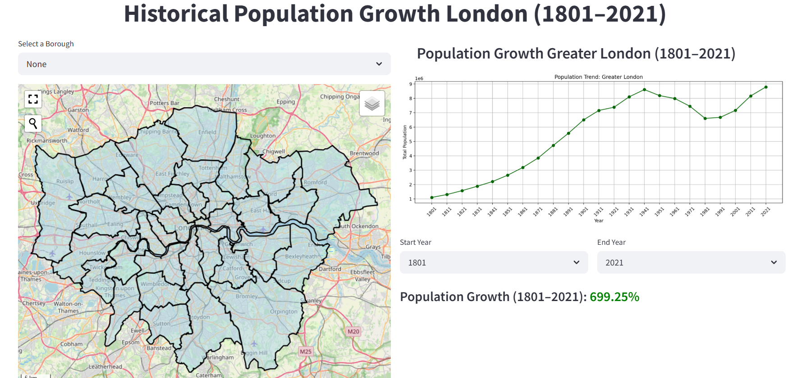
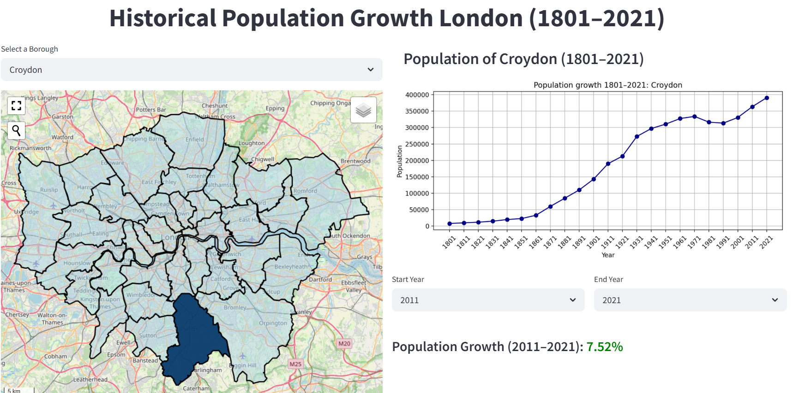

# Streamlit App - Explore Historical Population trends in London 
## Overview
**Streamlit**, an open-source Python library, to create an interactive dashboard, web applications. It allows developers to create powerful, interactive, and beautiful dashboards with minimal code. 
It is particularly useful for:
- **Data Visualization -- Create live graphs and charts**, **Build multi user apps**,  **Real-Time Interactive web apps**
For more information on Streamlit, check out their [official documentation](https://docs.streamlit.io/).

Streamlit is a powerful tool for urban planners and data scientists to quickly turn data analysis into interactive web applications. It enables seamless integration with geographic data, making it ideal for visualizing urban trends, population growth, and spatial analyses. With minimal code, you can create dynamic dashboards to share insights and make data-driven decisions in urban planning projects.

## License
Streamlit is completely free and open-source and licensed under the Apache 2.0 license.

## Streamlit Installing


```bash
python -m venv venv
source venv/bin/activate  # macOS/Linux
# or
venv\Scripts\activate     # Windows
```

```bash
pip install streamlit
```

# Example: 


London Historical Population Growth Dashboard (1801–2021)
An interactive web dashboard built with Streamlit that allows users to explore and visualize historical population growth across London boroughs from 1801 to 2021.

The tool is ideal for urban planners, researchers, and anyone interested in understanding demographic trends and population changes over time.

FThis project uses structured historical population data acquired from the London Datastore. The dataset is processed through data wrangling techniques and used to build an interactive dashboard using a structured app.py script.


📍 Key Features of dashboard

📊 Historical Population Data: Visualizes the population growth in each London borough from 1801 to 2021.

🌍 Interactive Map: Displays the geographic boundaries of each borough and allows users to select a specific borough for detailed analysis.

📈 Population Growth Calculation: Allows users to calculate the population growth between two selected years for a given borough.

🗺️ Data Visualization: Uses Matplotlib to generate line charts showing population trends.

🎨 Map Layering: Provides a color-coded map with the population growth data.



⚙️ Functionality

Choose a borough to see its population data.

📊 Growth Calculation: Calculate the population growth between two selected years.

📍 Interactive Map: View the map with borough boundaries highlighted.

📅 Year-based Filters: Select specific years to visualize data and calculate growth.



## 📁 Files
This project consists of two main files:

- `app.py` : Builds and runs the interactive Streamlit dashboard for visualizing population trends. ** Edit according to the project requirements**
- 'Data' : This folder comprises of .shp data used for this project
---

## 📦 Prerequisites

Ensure you have the following:

- Python 3.x


### Required Python Libraries

All required Python packages (and their specific versions) are listed in the `requirements.txt` file.

To install all dependencies:

```bash
pip install -r requirements.txt
```

This ensures consistent and reproducible environments across machines.

---

## 🛠 Installation

### 1️⃣ Clone the Repository

```bash
git clone https://github.com/Reproducible-Urban-Research/Streamlit-.git
cd Streamlit-

```

### 2️⃣ Create and Activate Virtual Environment

```bash
python -m venv venv
source venv/bin/activate  # macOS/Linux
# or
venv\Scripts\activate     # Windows
```

### 3️⃣ Install Dependencies

```bash
pip install -r requirements.txt
```


## 🚀 Usage

### 🖥️ Start the Streamlit App

Run the Flask server:

```bash
streamlit run app.py
```


